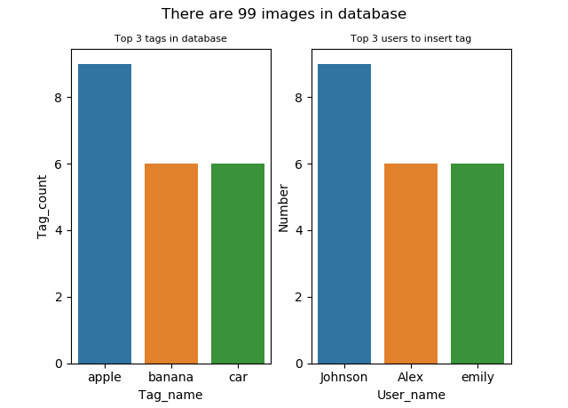

# How to use
## 如何宣告class
宣告database名稱、影像collection name、log collection name，會自行連到localhost
```
db_name = 'demo'
image_coll = 'image'
log_coll = 'log'
db = ImageDB(db_name, image_coll, log_coll)
```
## ImageDB class instruction
```
Press s to show the image from image_id
Press i to insert the tag of image
Press p to see the information of the image
Press a to show the summary of the database
Press q to quit
```
## ImageDB class method
### show_image
輸入想要查看的image_id
```
Select image ID to visualize : 
```
之後就會顯示，若找不到則會顯示ID Not found

### insert_tag
分別輸入以下資訊
```
Select image ID to insert the tag : 
Input the tag : 
Who are you: 
```
其中image id 可以同時輸入多張，但要用空格隔開

Select image ID to insert the tag : 1 10 777 23

之後會請使用者確認一次輸入資訊是否正確，按Y繼續進行，按N取消insert

若有找不到的image id 會顯示失敗，其他找的到的會顯示成功

### show_information
輸入想要查看資訊的image id
```
Select image ID : 
```
顯示除了content以外的資訊
```
{'_id': ObjectId('60bf25d3cbdfbcefe5adddd1'), 'img_id': '13', 'filename': '1.png', 'description': 'test image file', 'logs': ['add|banana|emily'], 'img_type': 'png', 'use_count': 0, 'uploader': 'admin', 'tags': ['banana'], 'credits': {}}
```

### show_summary
顯示整個database的資訊(tag數量最多的前n名、新增tag次數前n多的使用者、含有多少張影像)，如下圖



