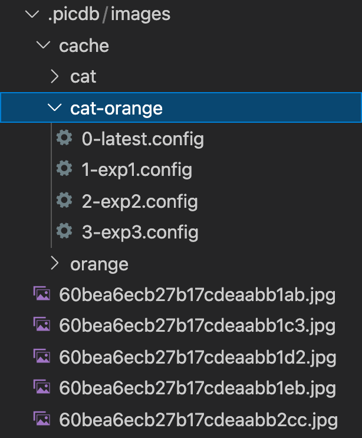

# APIs

## Basic methods

- `init()`: Initialized configuration and database connection

## Upload

- `upload_one_new_image()`: Upload an image with some tags and informations .
- `upload_file_of_new_images()`: Upload all images in the given file.

## Feedback

- `feedback()`: Given some _id and tags, increase(decrease) their tags credits. 
- `feedback_folder()`: Given a file path and tags, increase(decrease) their tags credits. 

## Search

- `show_image(image_id)`: Display the image of given image_id.
- `show_information(image_id)`: Display the information of given image_id.
- `show_summary()`:Display the overall informations of the database.

[](https://github.com/yobekili/DB_Final/blob/tagging/img/img.png)

## Download

- `get_images()`: Given a list of tags, return a set of images and save in the local image pool. You can also specify some other filter conditions. Further more, you can specify a version-name pair that can be used to save into you local cache. The cache store a list of id in that query.
- `move_images()`: Move some images to another user directory.

## Examples

```python
# Initialize instance
pic_db = PicDB()
pic_db.init()
```


```python
# Upload a picture
pic_db.upload_one_new_image(img_path='./cat.jpeg', up_loader='Jason', tags_list_like=['cat', 'cute'], description="a cute cat")

# Upload all pictures in ./animal
pic_db.upload_file_of_new_images(img_path='./animal', up_loader='Jason', tags_list_like=['cat', 'cute'], description="a cute cat")
```


```python
# Give a positive feedback to image 60c31d90ad37464e2742b2d1
pic_db.feedback(user='Jason', tags=['animal'], ids=['60c31d90ad37464e2742b2d1'], positive_feedback=True)

# Give a positive feedback to all images in ./cat
pic_db.feedback_folder(user='Jason', tags=['animal'], filepath='./cat', positive_feedback=True):
```


```python
# Display the image of '60c31d90ad37464e2742b2d1'
pic_db.show_image('60c31d90ad37464e2742b2d1')

# Display the information of '60c31d90ad37464e2742b2d1'
pic_db.show_information('60c31d90ad37464e2742b2d1')

# Display the overall informations of the database.
pic_db.show_summary()
```


```python
# Get images with the latest cache
pic_db.get_images(["catas"], limit=20)

# Get images from database and label the new cache version
pic_db.get_images(["cat", "orange"], use_cache=False, next_cache_name="exp1", limit=20)

# Get images from a labeled cache
pic_db.get_images(["meme", "cat"], cache_version=2)

# Move images from downloaded pool to another user directory
pic_db.move_images(["meme", "cat"], '../test-image', True, 2)
```


## Project Structure

- picdb: 
  - images/cache_dir.png
  - utils: 
    - __init__.py
    -  dir_utils.py
    -  cache_utils.py
    -  db_utils.py
    -  image_utils.py
   - PicDB.py
   - __init__.py

## Features
- **Image pool**: 
  - The client program will store images under a single directory. The default path is `/.picdb/images`. 
  - The image is named after the `ObjectId` field of the document in the MongoDB database. 
  - The user should not access this directory directly, but use APIs provided by us.
- **Cache management**: 
  - For every `tags` combination, the program will create a unique directory to store different versions of cache. 
  - There is a default `0-latest.config` after the first query from the database, which tracks the latest version of the cache information, including image list, image type, and additional information for further use.
  - Other than the latest cache, if users want to creat a new version of cache, they have to give a label name, which may not be unique, just for clearer identification, and the next cache version will be automatically determined by the program. Each version is incrementally increase, for example, 1, 2, 3, ... .
  - For each tags combination, we will create a lexicographically ordered directory that store the cache information
  - Therefore, if users want to use their cache with specific tags and version, they have to put tags and cache version in our `get_images()` API, to fetch images from local.
- **Download once**:
  - The image will be only downloaded once except it is explicitly deleted by our programs.
  - For each operation in our API function, it will first compare the downloaded image list and the query image list, then only download those are not in our image pool now.
  - Notice that the API may not download the exact number of images, but we guarantee that it will at least download the number of images that the user requires.

- **Retrieve images**:
  - Because we assume that the user will not directly access our image pool, we provide an additional API `move_images()` to let user copy these images to user's directory.
  - This method can prevent users from corrupting our internal image pool, and to make our download part simpler to implement.

## Cache Structure



## Implementation
The download APIs are wrapped in a single class called `PicDB`. The functionalities are distributed across several utils files under the `utils` folder. 

### Fetch images from database
The math model we based on is `set`, many operations are manipulated by set operaions. Thus, the structure is quite flat, we only implement each tags combination in the same level, for instance, `cat`, `cat-meme`, `meme`, and so on.

We first query images id list from the database instead of the images themselves to save the processing burden and network bandwidth. Then the images list will be compared with the local cache list, we then only download those are not downloaded from the database.

If user specifies a cache label, we will create a new version of cache under that tags folder, in a {version}-{name}.config format.

### Use local cache
In many use cases, the users will need to use the same set of images for comparison of their different products, then they can use a local cache to maintain the consistency.

However, if the cache does not contains enough images if the user specify a different image limit, the program will automatically download them from the database. 

The program will also check the integrity of the images number specified in the cache in the image pool now, if it find that there are some images that may be deleted, it will redownload them.

### Move images
The user are required to pass a specific version to the `move_images()` function, the default one is 0 (latest one). We will first get the given cache information and then determine how many images we have to move. If the user directory has some images moved befored, we will filter them out. The last step is just copy those needed to move to the user directory.

